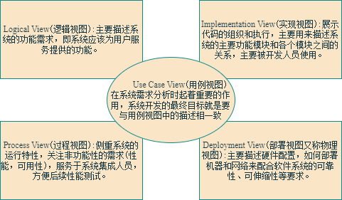

# 实验十_实验内容1：对比书上各种软件体系结构风格和视图特点，思考自己项目属于哪种设计风格？网上搜索最新的软件体系结构资料，如MVC、Kruchten 4+1视图等。

## 一、比书上各种软件体系结构风格和视图特点，思考自己项目属于哪种设计风格？

​	对比书上各种软件体系风格（管道和过滤器、客户-服务器、对等网络、发布-订阅、信息库和分层），本项目（企业人力资源管理系统）适合采用分层架构与客户-服务器架构的混合风格。

- **分层架构的适配性分析**
	- **1.系统复杂度与关注点分离**
			人力资源管理系统包含员工信息管理、考勤统计、薪资计算等多个功能模块，业务逻辑复杂。分层架构通过将系统划分为表现层、业务逻辑层和数据访问层，实现了:
			职责清晰划分：前端专注于用户交互，后端处理业务规则，数据库负责数据持久化
			开发效率提升：不同团队可并行开发各层组件（如UI团队与后端团队）
			维护成本降低：修改某一层（如数据库从MySQL迁移至PostgreSQL）不会影响其他层
	- **2.Java技术栈的天然匹配**
		本系统"后端采用Java技术生态"，而Java生态系统（特别是Spring框架）本身就是基于分层理念设计的：
			Spring MVC：强制性的Controller-Service-Repository分层
			MyBatis：隔离SQL与业务代码
			Spring Security：独立的安全认证层
	- **3.可测试性与质量保障**
		分层架构为系统提供了天然的测试切入点：
			单元测试：可独立测试Service层的薪资计算算法
			集成测试：验证Controller与Service的交互
			UI自动化测试：针对表现层的操作流程测试

- **客户-服务器架构的必要性**
	- **1.多客户端支持需求**
		系统需要同时支持：
			Web管理端：HR人员使用的功能完整的管理界面
			移动端：员工打卡使用的精简界面
			第三方集成：与企业微信、考勤设备API的对接
	- **2.安全控制集中化**
		本系统强调"基于角色的访问控制模型"和"数据隔离机制"，客户-服务器架构允许：
			统一认证中心：所有请求必须通过JWT验证
			集中审计：在服务端记录所有敏感操作日志
			数据脱敏：在服务端根据权限过滤响应数据
	- **3.分布式部署优势**
		系统需要"优秀的并发处理能力"和"高可用性设计"，客户-服务器架构支持：
			水平扩展：无状态服务可轻松增加实例
			负载均衡：Nginx分发请求到多个服务节点
			容灾备份：服务集群避免单点故障

## MVC模型
​	MVC 模型 是一种软件设计模式，用于将应用程序的逻辑分为三个核心组件：Model（模型）、View（视图） 和 Controller（控制器）。这种分层架构的目的是实现关注点分离，使代码更易于维护、扩展和测试。MVC 模型广泛应用于 Java Web 开发中，尤其是在 Spring MVC、Struts 等框架中。
- **MVC 模型的三个核心组件**
	- **1.Model（模型）**
		负责管理应用程序的核心数据和业务逻辑。
		模型通常包括：数据访问层（如 DAO、Repository）、业务逻辑层（如 Service）。
		模型不直接与用户交互，而是通过控制器与视图通信。
	- **2.View（视图）**
		负责展示数据（用户界面）。
		视图从模型中获取数据，并将其渲染为用户可见的界面（如 HTML 页面、JSON 数据等）。
		视图不处理业务逻辑，只负责显示数据。
	- **3.Controller（控制器）**
		负责处理用户输入（如 HTTP 请求），并调用模型和视图来完成请求。
		控制器接收用户请求，调用模型处理业务逻辑，然后选择适当的视图来渲染结果。
- **MVC 工作流程** 
	- 1.用户通过视图（如浏览器）发起请求。
	- 2.控制器接收请求，解析用户输入。
	- 3.控制器调用模型处理业务逻辑，并获取数据。
	- 4.控制器将数据传递给视图。
	- 5.视图渲染数据，生成用户界面并返回给用户。

## Kruchten 4+1视图
​	“4 + 1”视图模型由Philippe Kruchten提出，用于多维度描述复杂软件系统的架构，确保不同利益相关者（如开发者、运维、用户）对系统有一致的理解。每个视图关注不同层面，以下是各视图的特点及适用场景：
- **1. 逻辑视图（Logical View）**
	- **特点**
		核心内容：描述系统的功能模块、类、接口及其交互关系。
		核心工具：类图、对象图、状态图。
		关注点：系统为用户提供的功能服务，以及模块之间的静态逻辑关系。
	- **适用场景**
		需求分析阶段：明确系统功能模块划分（如用户管理、订单处理）。
		面向对象设计：定义类与接口的继承、组合关系（如电商系统中的 Order、Product、User 类）。
		示例：电商平台的逻辑视图需展示购物车、支付、库存管理等模块的交互。
- **2. 开发视图（Development View）**
	- **特点**
		核心内容：软件模块的代码组织结构、组件依赖关系和分层架构。
		核心工具：组件图、包图、分层架构图。
		关注点：代码的可维护性、模块化开发及团队协作分工。
	- **适用场景**
		系统架构设计阶段：规划代码仓库结构（如MVC分层、微服务模块划分）。
		开发团队协作：定义模块接口规范（如API服务与数据库访问层的依赖）。
		示例：开发视图可能展示 frontend（前端）、backend（后端）、database（数据库）的分层架构。
- **3. 进程视图（Process View）**
	- **特点**
		核心内容：系统的运行时行为，包括进程、线程、通信机制及并发控制。
		核心工具：活动图、序列图、通信图。
		关注点：性能优化、资源争用、容错处理等动态问题。
	- **适用场景**
		高并发系统设计：如在线游戏的实时交互、金融交易系统的订单撮合。
		分布式系统开发：定义服务间通信协议（如RPC、消息队列）。
		示例：进程视图需描述订单支付流程中的分布式事务协调机制。
- **4. 物理视图（Physical View）**
	- **特点**
		核心内容：硬件基础设施部署，包括服务器、网络拓扑、存储设备等。
		核心工具：部署图、网络拓扑图。
		关注点：系统的可扩展性、容灾能力及资源利用率。
	- **适用场景**
		系统部署与运维：规划服务器集群、负载均衡策略（如Kubernetes集群部署）。
		性能调优：分析硬件瓶颈（如数据库服务器的磁盘IO性能）。
		示例：物理视图需展示Web服务器、缓存服务器、数据库服务器的部署位置及网络连接。
- **5. 场景视图（Scenarios / Use Case View）**
	- **特点**
		核心内容：通过典型业务场景（用例）串联其他视图，验证架构的完整性。
		核心工具：用例图、用户故事、流程图。
		关注点：系统如何满足用户的实际需求，各视图是否协调一致。
	- **适用场景**
		需求验证阶段：确保功能设计覆盖用户核心流程（如用户注册、下单支付）。
		架构评审：通过关键场景验证逻辑、进程等视图的可行性。
		场景视图描述“用户登录”涉及的前端界面（逻辑视图）、认证服务（进程视图）及服务器部署（物理视图）。

