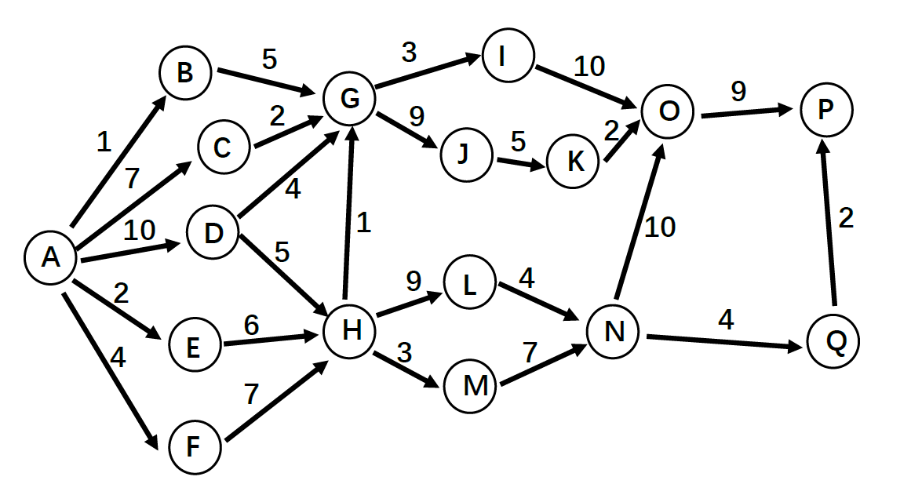

# 实验一
## 实验目的：
1. 团队（小组）建立
2. 课程项目的讨论和选择
3. 对项目进行可行性分析并写作**可行性分析报告**（草稿）

## 实验内容：
1. **团队**：学生分组（5 人一组，组员优势互补，可以跨班，组名自定）
	1. 要求每组民主产生一名组长 (也可采用轮换制)，负责小组工作的安排
	2. 我们实验需要提交几个主要报告，每个报告需要所有小组成员共同参与完成，可以实名说明那部分工作是谁完成的，然后将组内成员都同意的报告最终版提交给助教。（需要提交报告时会至少提前一周通知，强烈建议大家尽早完成）
2. **课程项目的讨论和选择**
	1. 可以选择课本的项目（书本第 1.14 章），或者选择我整理的一些项目实例（对于其中的每一个项目，可以进行功能等的调整），也可以选择其它项目
	2. 选择其它项目时，请先向助教题提交一个 300-500 字的关于项目的说明
	3. 每个组选择一种协作开发平台进行项目的开发（强烈建议使用 GitHub），将项目地址及每个组员的 GitHub 账号名称告诉助教，在提交代码、文档、或者其它 artifact 时，如果是一个人完成的，请直接用自己的账号提交，如果是多个人完成的，请注明具体那部分是谁完成的
3. **可行性分析**
	1. 对选择的项目进行可行性分析，并写**可行性分析报告**的初稿 （**大纲草稿**），可参考软件设计文档国标及其它可行性分析报告实例，由于项目较小，不要求面面俱到，不涉及的部分可以不写
	2. 本周日前将小组名单（组名，组员等）、项目名称、拟采用的协作开发平台填入群内的腾讯文档（随后会发布）

# 实验二 持续沟通修订可行性分析报告、CASE 调研
## 实验目的：
1. 持续项目沟通、调查，修订可行性分析报告
2. 调研 CASE 软件工具，并学会使用

# 实验内容：
1. 按照分组继续进行项目沟通调查，对上周的可行性分析报告进行修订。注意项目内容的补充和调整 (随需求变动)
2. **CASE** (Computer-Aided Software Engineering, 计算机辅助软件工程) **工具**调研及应用
	1. 小组分工搜索各种主流软件工程技术网站，调研有哪些流行的 CASE 工具 (如教材中提到的**甘特图**等)，**分析它们的用途、技术特点**
	2. CASE 工具举例 (不限，可以自己搜)：
		1. Microsoft Visio; Product Studio; Visual SourceSafe；TFS
		2. Smartdraw，MagicDraw
		3. Rational Rose
		4. Sybase PowerDesigner
		5. Enterprise Architect
		6. StarUML， PlantUML
		7. ModelMake
		8. Umbrello TOgether
		9. Poseidon
		10. UMLStudio
		11. Visual Paradigm for UML
		12. Marvel
		13. CodeLogic
		14. ArchStudio (Eclipse 插件)
		15. Apache JMeter
		16. git
		17. CVS
		18. ClearCase
	3. 小组根据调研情况讨论，结合自己的项目和拟使用的技术路线，选择适合的 CASE 工具，**补充、完善所做的可行性分析报告**
	4. 将小组工作文档、进度等文档保存到每个小组选定的协作开发平台上

# 实验三  软件过程模型、Scrum 开发方法、可行性分析报告
## 实验目的：
1. 研讨传统软件开发过程模型与敏捷开发
2. 了解 Scrum 开发方法
3. 完成可行性分析报告

## 实验内容：
1. 小组分工讨论**传统软件开发过程模型与敏捷开发** (中几种主要方法) 的比较，**分析各自的优缺点**，以及如何应用于自己的项目中？并且分析自己项目中可能存在的**风险**，**细化风险管理** (做出风险分级及应对预案)
2. 阅读 **Scrum 开发方法**文档，理解 **Scrum** 过程工作模型  
3. 完成**可行性分析报告**
4. **下周五 (含) 前将可行性分析报告提交给相应的助教**
5. 将小组工作文档、进度等文档保存到每个小组选定的协作开发平台上

# 实验四  XP 开发方法，DevOps，活动图
## 实验目的：
1. 了解 XP 开发方法
2. 了解 DevOps
3. 理解项目活动图

## 实验内容：
1. 阅读 XP 开发方法文档，理解 XP 过程工作模型  
2. 阅读 DevOps 文档，了解 DevOps
3. 活动图练习
	1. 书上练习题 2, 3（P97-98） 的软件开发项目活动图，找出关键路径
	2. 小组讨论，针对自己项目中的工作进行工作活动分解，分工进行各自合理的**工作进度估算**，最后**汇总绘出项目活动图，找出关键路径**
	3. 将小组工作文档、进度等文档保存到每个小组选定的协作开发平台上

# 实验五  理解活动图, 项目过程跟踪工具, 人力资源组织结构
## 实验目的：
1. 深入理解项目活动图
2. 练习项目跟踪工具的使用
3. 讨论人力资源管理、组织结构

## 实验内容：
1. 下图是一个软件开发项目的**活动图**，边长代表天数。请分析在图上标出每一个活动的最早开始时间、最晚开始时间和时差。然后找出关键路径和其总长度

1. 练习项目跟踪工具的使用，如用**甘特图记录跟踪项目过程**
2. **调研国内外软件开发团队组织结构和工作方式对比**
	1. 分工调研国内与国外软件开发团队的管理方式**对比**（如：996 工作制）
	2. 从**个人角度**，你最喜欢的工作方式、工作环境条件、可接受的约束等是什么？
	3. 从**团队项目管理角度**，你认为最有效的项目组工作管理方式是什么？
	4. 项目跟踪，**建立能反映项目及小组每个人工作的进度、里程碑、工作量的跟踪图或表**，每周更新

# 实验六  工作量估算，风险管理，软件需求规格说明 SRS (1)
## 实验目的：
1. 工作量估算
2. 风险管理
3. 学习软件需求规格说明 SRS 文档的要求和结构

## 实验内容：
1. 工作量估算：
	1. Ch3 习题 12（小组讨论）
	2. 参考书 3.7（P94） 皮卡地里电视广告销售系统按 **COCOMOII** 的工作量模型进行工作量估算的例子（结合 P79-80 表），估算自己项目的初始工作量
2. 风险管理：
	1. Ch3 习题 11（小组讨论）
	2. 分析自己项目中可能存在的风险，并进一步细化风险管理（做出风险分级及应对预案）。
3. 学习国标中的文档 11《软件需求规格说明 SRS》，了解文档的要求和结构及与其他相关文档的关系。（文档见实验 1 的压缩文件）
4. 项目跟踪，建立能反映项目及小组每个人工作的进度、里程碑、工作量的跟踪图或表，每周更新。

# 实验七  软件需求规格说明 SRS (2)
## 实验目的：
1. 写作自己项目的 SRS 初稿
2. 学习最新软件需求规格说明 SRS 文档的要求和特点
3. 练习用各种静态建模工具 (E-R、UML 等) 对所负责的项目进行建模，与用户沟通。

## 实验内容：
1. 搜集软件需求规格说明 SRS 编写案例
2. 基于已积累的资料，写作自己项目的 SRS 草稿 (大纲)
3. 阅读《掌握需求过程 (第 3 版) 》，对比其附录 A 和国标 SRS 的模板，**分析有什么不同和特点**。
4. 选择其中必要的部分，补充进自己项目的 SRS。
5. 参照课本及 PPT 上例子，练习用静态建模 (E-R、UML) 等工具对所负责的系统建模，用模型 model 与用户沟通。
6. 分析、归纳、总结出符合实际的需求规格。
7. 分工协作，用上面的工作**补充完善**SRS 和所负责的项目。
8. 项目跟踪，建立能反映项目及小组每个人工作的进度、里程碑、工作量的跟踪图或表，将其保存到每个小组选定的协作开发平台上，每周更新。

# 实验八  软件需求规格说明 SRS (3)
## 实验目的：
1. 学习 Petri 网基本知识及如何**应用 Petri 网建模**
2. 练习用各种动态建模工具 (状态图、Petri 网、数据流图、OCL 逻辑等) 对所负责的项目进行建模
3. 完善自己项目的 SRS

## 实验内容：
1. 阅读“SYSTEM MODELLING WITH PETRI NETS”，进一步学习 Petri 网知识，了解如何应用 Petri 网对系统进行建模
2. 针对各自负责项目的不同场景，**练习**用各种**动态建模工具** (状态图、Petri 网、数据流图、OCL 逻辑等) 建模需求，与用户沟通。
3. 参考第 4 章，4.12 皮卡迪里电视广告售卖系统，分析、归纳、总结出符合实际的需求规格。
4. 分工协作，用上面的工作补充完善 SRS 和所负责的项目。
5. 项目跟踪，建立能反映项目及小组每个人工作的进度、里程碑、工作量的跟踪图或表，将其保存到每个小组选定的协作开发平台上，每周更新。

# 实验九  UML，逻辑， 软件体系结构设计（一）
## 实验目的：
1. 深入理解 UML
2. 了解计算机学科中的逻辑
3. 学习对比软件体系结构设计 GB 和 IEEE 最新 SAD (Software Architecture Document) 的标准
4. 研究经典软件体系结构案例
5. 完成自己项目的 SRS

## 实验内容：
1. 阅读“The Unified Modeling Language Reference Manual”，进一步学习 UML 知识，理解如何应用 UML 对系统进行建模
2. 浏览“LOGIC IN COMPUTER SCIENCE--Modelling and Reasoning about Systems”，了解常用逻辑及其在计算机学科中的应用
3. 分工协作，参考国标“13 - 软件 (结构) 设计说明 (SDD)”等资料，对比参考 SAD 最新标准 IEEE-42010.pdf，针对自己的项目设计 SAD 初稿。
4. 分工协作，学习、检索研究经典软件体系结构案例。
5. 完成软件需求规格说明 SRS
6. **下周五（含）前将软件需求规格说明提交给相应的助教**
7. 项目跟踪，建立能反映项目及小组每个人工作的进度、里程碑、工作量的跟踪图或表，将其保存到每个小组选定的协作开发平台上，每周更新。

# 实验十  软件体系结构设计（二）
## 实验目的：
1. 体系结构风格和视图特点
2. 研究经典软件体系结构案例
3. 继续补充和修改自己项目的 SAD

## 实验内容：
1. **对比书上各种软件体系结构风格和视图特点，思考自己项目属于哪种设计风格？**
2. 网上搜索最新的软件体系结构资料，如 MVC、Kruchten 4+1 视图等
3. 参阅课本和网上资料，研究经典软件体系结构案例 KWIC
	1. An Introduction to Software Architecture，4.1 节
	2. On-the-Criteria-To-Be-Used-in-Decomposing-Systems-into-Modules（Example System 1）
4. 针对 KWIC 和自己项目，参考课本 Ch5 表 5-3，小组成员每人给几种不同的体系结构风格设计打分，评最佳
5. 补充和修改自己项目的 SAD
6. 记录项目及小组每个人工作的进度、里程碑、工作量的跟踪图或表，将其保存到每个小组选定的协作开发平台上，每周更新

# 实验十一  软件体系结构设计（三）
## 实验目的：
1. 深入理解体系结构的设计和评估改进
2. 完成 SAD

## 实验内容：
1. 继续完成上周的实验任务
2. 完成自己项目的 SAD
3. 下周五（含）前将体系结构设计文档 SAD 提交给相应的助教
4. 项目跟踪，建立能反映项目及小组每个人工作的进度、里程碑、工作量的跟踪图或表，将其保存到每个小组选定的协作开发平台上，每周更新。

# 实验十二  设计模块（一）
## 实验目的：
1. 培养设计原则实践的能力
2. 学习依赖注入（dependency injection）
3. 面向对象设计原则

## 实验内容：
1. 参考教材 6.2，结合项目的进程和开发历程，从设计原则的几个方面，组员对负责设计的模块进行评估，思考存在的问题和解决方案
2. 阅读下面 DI 资料（或查阅其它相关资料），学习依赖注入技术
	1. Dependency injection - Wikipedia
	2. Dependency Injection-A Practical Introduction.pdf
3. 论述利斯科夫替换原则（里氏代换原则）、单一职责原则、开闭原则、德（迪）米特法则、依赖倒转原则、合成复用原则，结合自己的实践项目举例说明如何应用 （保存到每个小组选定的协作开发平台上，以组为单位）
4. 项目跟踪，建立能反映项目及小组每个人工作的进度、里程碑、工作量的跟踪图或表，将其保存到每个小组选定的协作开发平台上，每周更新
