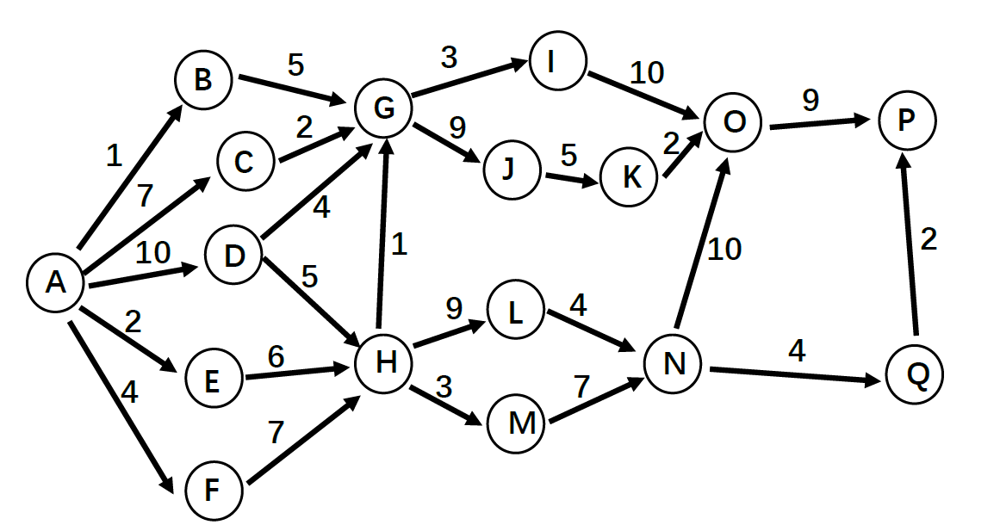

2025/2/28 大三下学期（24-25 学年第二学期）第二周 软件工程课程实验开始～
2025/6/15 第十七周，验收实验，实验正式结束。

# 写在前面
每一周的任务都分为团队工作和个人工作，团队工作是每个人都需要进行的工作（通常是讨论、搜集资料），个人工作是团队成员需要独立完成的工作（包括对于讨论内容整理、撰写文档的某一部分等）。

# 第二周
## 团队工作
实验一：
1. 分组
2. 课程项目的讨论和选择
3. 可行性分析报告初稿撰写

## 个人工作
无

# 第三周
## 团队工作
实验二：
1. 按照分组继续进行项目沟通调查，对上周的可行性分析报告进行修订。注意项目内容的补充和调整 (随需求变动)
2. **CASE (Computer-Aided Software Engineering, 计算机辅助软件工程) 工具调研及应用**
    1. 小组分工搜索各种主流软件工程技术网站，调研有哪些流行的 CASE 工具 (如教材中提到的**甘特图**等)，分析它们的用途、技术特点
    2. CASE 工具举例 (不限，可以自己搜)：
        1. Microsoft Visio; Product Studio; Visual SourceSafe；TFS
        2. Smartdraw，MagicDraw
        3. Rational Rose
        4. Sybase PowerDesigner
        5. Enterprise Architect
        6. StarUML， PlantUML
        7. ModelMake
        8. Umbrello TOgether
        9. Poseidon
        10. UMLStudio
        11. Visual Paradigm for UML
        12. Marvel
        13. CodeLogic
        14. ArchStudio (Eclipse 插件)
        15. Apache JMeter
        16. git
        17. CVS
        18. ClearCase
    3. 小组根据调研情况讨论，结合自己的项目和拟使用的技术路线，选择适合的 CASE 工具，补充、完善所做的可行性分析报告
    4. 将小组工作文档、进度等文档保存到每个小组选定的协作开发平台上

## 个人工作

| 负责人 |                 完成工作                  |
| :-: | :-----------------------------------: |
| 王凌杰 |           完成小组内任务分工，协调成员工作            |
| 杨发轶 | 对于小组成员搜集到的 CASE 工具的资料进行整理，并提交到 github |

# 第四周
## 团队工作
实验三：
1. 小组分工讨论**传统软件开发过程模型与敏捷开发** (中几种主要方法) 的比较，**分析各自的优缺点**，以及如何应用于自己的项目中？并且分析自己项目中可能存在的**风险**，**细化风险管理** (做出风险分级及应对预案)
2. 阅读 **Scrum 开发方法**文档，理解 **Scrum** 过程工作模型  
3. 完成**可行性分析报告**

## 个人工作
任务一: 分工完成可行性分析报告

*注：报告在第二、三、四周共三周时间内完成，并非一周完成的*

|   负责人   |                  完成工作                  |
| :-----: | :------------------------------------: |
| 王凌杰（组长） | 负责任务的统筹规划，可行性报告中第一、二、三章的撰写，以及最后的检查和完善。 |
|   蒋中骐   |     负责可行性报告中第四、五、六章的撰写，以及报告中图片的绘制。     |
|   杨发轶   |           负责可行性报告中第七、八章的撰写。            |
|   王诚来   |            负责可行性报告中第九章的撰写。             |
|   伏豪    |            负责可行性报告中第十章的撰写。             |

任务二：实验内容一：*传统软件开发过程模型与敏捷开发的比较及其在用户中心项目中的应用* 的整理

| 负责人 |               完成工作               |
| :-: | :------------------------------: |
| 王凌杰 |         完成小组内任务分工，协调成员工作         |
| 蒋中骐 | 对于小组成员搜集、讨论的内容进行整理，并提交到 github 上 |

# 第五周
## 团队工作
实验四：
1. 阅读 XP 开发方法文档，理解 XP 过程工作模型  
2. 阅读 DevOps 文档，了解 DevOps
3. 活动图练习
    1. **书上练习题 2, 3（P97-98） 的软件开发项目活动图，找出关键路径**
    2. **小组讨论，针对自己项目中的工作进行工作活动分解，分工进行各自合理的工作进度估算，最后汇总绘出项目活动图，找出关键路径**
    3. 将小组工作文档、进度等文档保存到每个小组选定的协作开发平台上

## 个人工作
| 负责人 |                 完成工作                 |
| :-: | :----------------------------------: |
| 王凌杰 |           完成小组内任务分工，协调成员工作           |
| 蒋中骐 | 对于第三题将小组成员搜集、讨论的内容进行整理，并提交到 github 上 |

# 第六周
## 团队工作
实验五：
1. 下图是一个软件开发项目的**活动图**，边长代表天数。请分析在图上标出每一个活动的最早开始时间、最晚开始时间和时差。然后找出关键路径和其总长度 

2. 练习项目跟踪工具的使用，如用**甘特图记录跟踪项目过程**
3. **调研国内外软件开发团队组织结构和工作方式对比**
    1. 分工调研国内与国外软件开发团队的管理方式**对比**（如：996 工作制）
    2. 从**个人角度**，你最喜欢的工作方式、工作环境条件、可接受的约束等是什么？
    3. 从**团队项目管理角度**，你认为最有效的项目组工作管理方式是什么？
    4. 项目跟踪，**建立能反映项目及小组每个人工作的进度、里程碑、工作量的跟踪图或表**，每周更新

## 个人工作

| 负责人 |                 完成工作                  |
| :-: | :-----------------------------------: |
| 王凌杰 | 完成小组内任务分工，协调成员工作, 完成问题一，并提交到 github 上 |
| 蒋中骐 | 根据团队讨论结果，建立本项目的甘特图（问题二），并提交到 github 上 |
| 杨发轶 |  对于团队搜集和讨论的有关问题三的内容进行整理，提交到 github 上  |

# 第七周
清明节假期，团队无工作任务

# 第八周
## 团队工作
实验六：
1. 进行有关工作量估算和风险管理的小组讨论，选出成员整理文档
2. 学习国标中的文档 11《软件需求规格说明 SRS》，了解文档的要求和结构及与其他相关文档 （07,08,12,17 等）的关系。

## 个人工作

|  负责人   |       完成工作       |               交付物                |
| :----: | :--------------: | :------------------------------: |
|  王凌杰   | 完成小组内任务分工，协调成员工作 |                \                 |
| 伏豪&杨发轶 |    整理工作量估算文档     | doc/lab6/实验六\_ 实验内容 1\_ 工程量估算.md |
|  王诚来   |     整理风险管理文档     | doc/lab6/实验六 \_ 实验内容 2\_ 风险管理.md |

# 第十、十一、十二周
## 团队工作
实验七：
1. 搜集“软件需求规格说明 SRS”编写案例。
2. 阅读《掌握需求过程 (第 3 版) 》，对比其附录 A 和国标 SRS 的模板，分析有什么不同和特点。选择其中必要的部分，补充进自己项目的 SRS。
3. 参照课本及 PPT 上例子，练习用**静态建模** (E-R、UML) 等工具对所负责的系统建模，用模型 model 与用户沟通。分析、归纳、总结出符合实际的需求规格。分工协作，用上面的工作补充完善 SRS 和所负责的项目。

实验八：
1. 阅读“SYSTEM MODELLING WITH PETRI NETS”，进一步学习 Petri 网知识，了解如何应用 Petri 网对系统进行建模。
2. 针对各自负责项目的不同场景，练习用各种**动态建模**工具 (状态图、Petri 网、数据流图、OCL 逻辑等) 建模需求，与用户沟通。
3. 用上面的工作补充完善 SRS 和所负责的项目。

实验九：
1. 阅读“The Unified Modeling Language Reference Manual”，进一步学习 UML 知识，理解如何应用 UML 对系统进行建模
2. 浏览“LOGIC IN COMPUTER SCIENCE--Modelling and Reasoning about Systems”，了解常用逻辑及其在计算机学科中的应用
3. 分工协作，参考国标“13 - 软件 (结构) 设计说明 (SDD)”等资料，对比参考 SAD 最新标准 IEEE-42010.pdf，针对自己的项目设计 SAD 初稿。
*SAD(Software Achitecture Document), SDD(Software)* 
4. 分工协作，学习、检索研究经典软件体系结构案例。On-the-Criteria-To-Be-Used-in-Decomposing-Systems-into-Modules.pdf http://www.cs.cmu.edu/~ModProb/index.html

## 个人工作
核心任务：完成 SRS 文档

| 负责人 |                 完成工作                  |
| :-: | :-----------------------------------: |
| 王凌杰 | 完成小组内任务分工，协调成员工作，绘制文档相关图表，对于文档进行完善、补充 |
| 蒋中骐 |         完成第 3 章 3.1 到 3.4 部分          |
| 杨发轶 |         完成第 3 章 3.5 到 3.9 部分          |
| 王诚来 |            完成第 1、2、4、5 章内容            |

# 第十三周
## 团队工作
实验十：
1. 对比书上各种软件体系结构风格和视图特点，**思考**自己项目属于哪种**设计风格**？网上搜索最新的软件体系结构资料，如 MVC、Kruchten 4+1 视图等。
2. 参阅课本和网上资料，研究经典软件体系结构案例 KWIC。
   An Introduction to Software Architecture，4.1 节 On-the-Criteria-To-Be-Used-in-Decomposing-Systems-into-Modules（Example System 1） http://www.cs.cmu.edu/~ModProb/index.html 。针对 KWIC 和自己项目，参考课本 ch5 表 5-3，小组成员每人给几种不同的体系结构风格设计**打分**，评最佳。
3. 补充和修改自己项目的 SAD

## 个人工作
| 负责人 |            完成工作            |
| :-: | :------------------------: |
| 王凌杰 | 完成小组内任务分工，协调成员工作，完成 SAD 草稿 |
| 蒋中骐 |         完成 SAD 草稿          |
| 杨发轶 |         完成 SAD 草稿          |
| 王诚来 |  对于设计风格部分的讨论内容（问题一）进行总结整理  |
| 伏豪  |   对于体系结构风格的内容进行总结整理（问题二）   |

# 第十四周
*注：虽然这个标题给的是十四周，但是是在十三周预先写成的，是我们小组提前对于 SAD 报告安排的分工！* 
## 团队工作
实验十一：
合作完成 SAD 文档

## 个人工作
核心任务：

| 负责人 |                            完成工作                            |
| :-: | :--------------------------------------------------------: |
| 王凌杰 | 完成小组内任务分工，协调成员工作，==完成部分 SAD 插图的绘制和第六、七章内容的整理==，对于文档进行完善、补充 |
| 蒋中骐 |            ==完成 SAD 第四章、第五章插图的绘制==，对于文档进行完善、补充             |
| 杨发轶 |            ==完成 SAD 第四章、第五章内容的整理==，对于文档进行完善、补充             |
| 王诚来 |                  ==完成 SAD 第一、二、三章内容的整理==                   |
| 伏豪  |                    ==为报告补充部分体系结构方面的内容==                    |
|     |                                                            |
# 第十五周
## 团队工作
实验十二：
1. **参考教材 6.2，结合项目的进程和开发历程，从设计原则的几个方面，组员对负责设计的模块进行评估，思考存在的问题和解决方案。**
2. 阅读下面 DI 资料（或查阅其它相关资料），学习依赖注入技术。
	Dependency injection - Wikipedia
	Dependency Injection-A Practical Introduction.pdf
3. **论述利斯科夫替换原则（里氏代换原则）、单一职责原则、开闭原则、德（迪）米特法则、依赖倒转原则、合成复用原则，结合自己的实践项目举例说明如何应用 （保存到每个小组选定的协作开发平台上，以组为单位）。**

## 个人工作
核心任务：

| 负责人 |             完成工作              |
| :-: | :---------------------------: |
| 王凌杰 | 完成小组内任务分工，协调成员工作，整理完成实验十二的题目三 |
| 蒋中骐 | 上传”人力资源管理系统“到 github，并给出部署流程  |
| 杨发轶 |              同上               |
| 王诚来 |         整理完成实验十二的题目一          |
| 伏豪  |               -               |

# 第十六周
## 团队工作
实验十三：
1. 阅读下面设计模式资料（或查阅其它相关资料），结合项目的进程和开发历程，分析项目采用了那些设计模式
Design Patterns-Elements of Reusable Object-Oriented Software.pdf
The GoF Design Patterns Reference.pdf
[Design Patterns - Wikipedia](https://en.wikipedia.org/wiki/Design_Patterns)
2. 给出 4 种设计模式的例子（语言不限，以组为单位），并总结其特点 （保存到每个小组选定的协作开发平台上）

## 个人工作
核心任务：

| 负责人 |               完成工作               |
| :-: | :------------------------------: |
| 王凌杰 |   完成小组内任务分工，协调成员工作，==完善里程碑文档==   |
| 蒋中骐 | ==上传”人力资源管理系统“到 github，并给出部署流程== |
| 杨发轶 |                同上                |
| 王诚来 |   ==整理完成实验十三的题目一，并上传到 github==   |
| 伏豪  |   ==整理完成实验十三的题目二，并上传到 github==   |
